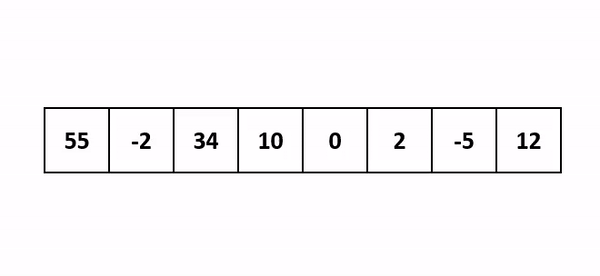

# Insertion Sort 

For this assignment, you are going to implement in 'C' the insertion sort algorithm. A skeleton file has been provided called [sort.c](./sort.c). The nice thing about sorting algorithms is that you will know your result is correct, if the data you have sorted is printed out to the terminal in ascending order (i.e. the ordering begins with the lowest number first).

## Insertion sort at a high level


Insertion sort is a fundamental sorting algorithm that builds the final sorted array one item at a time. Conceptually the algorithm divides the input array into a sorted and unsorted part. At each iteration the algorithm checks the first element in the unsorted portion of the array and tries to place it in the right position in the sorted portion of the array. As the sort progresses the unsorted part becomes smaller and eventually the the sorted part of the array becoming the size of the entire array. 

Insertion sort provdes several advantages over other sorts (although slower than more efficient sorts such as heapsort, quicksort, or mergesort which we will later learn):

* It is simple to implement 
* It is more efficient in practice than most other simple quadratic (i.e., O(n^2)) sorts such as selection sort or bubble sort for small data sets.
* It is efficient for data sets that are already substantially sorted. 
* It does in-place sorting
   * [In-place](https://en.wikipedia.org/wiki/In-place_algorithm) sorting means that it only requires a constant amount O(1) of additional memory space 
   * (i.e. no additional arrays are created to temporarily store data)

You can watch [this](https://youtu.be/OGzPmgsI-pQ) to visually see how insertiong srt works.

## Pseudo-code

The pseudo-code for insertion sort goes as follows:

```c
1. Start with the first element being in the sorted part of your array.
2. Look at the first element of the unsorted part of your array. 
3. Iterate through the sorted part of your array, find the correct position where to insert the element form part 2.
   - (Hint: you need to put the element in front of the first element that is smaller than your current element. )
4. Repeat steps 2. and 3. until the sorted part of your array becoems the entire array.
```




Note: Regardless if we are using an array or a linked list, the algorithm looks the same. However, for this assignment, an array is slightly easier to work with when swapping elements.

## Designing the algorithm

An algorithm itself does not have to be one single function. Sometimes it is helpful to have some 'helper functions' to make the code easier to understand. For insertion sort, we recommend at least functions: 

1. swap -- Swaps two integers in an array
2. sortIntegers -- This is where you will perform the actual insertion sort.


